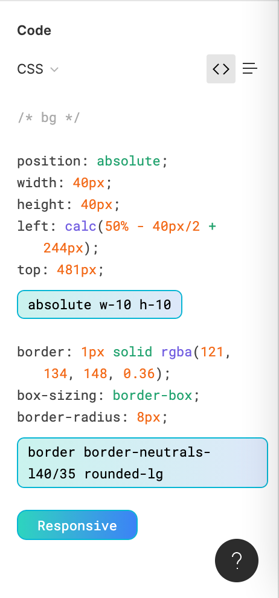

# `tailwind-tools`



## Figma extension features:
- Convert Figma CSS rules to Tailwind classes automatically right in the Figma inspector pane. Supports Tailwind JIT as well as Tailwind 2.2 opacity shorthand syntax
- Automatically get a set of responsive Tailwind classes by clicking elements in the Figma window.

## Library functions:
- [Translate from a set of CSS properties into one or more Tailwind classes.](https://github.com/zakkor/tailwind-tools/blob/main/src/translate.js) e.g.: `translate('margin-top: 4px; margin-bottom: 4px')` -> `my-1`. Can translate multiple independent properties to multiple classes too. 
- [Sort Tailwind classes according to a user-defined order.](https://github.com/zakkor/tailwind-tools/blob/main/src/sort.js) Because we leverage Tailwind internal functions, the sort order can be defined in terms of easy-to-understand Tailwind "plugins" (or groups of rules) - no need to resort to crazy regexes or listing out thousands of individual rules for each value. [See the default sort order for an example.](https://github.com/zakkor/tailwind-tools/blob/main/src/sort.js#L4-L206)
- [Merge multiple Tailwind classes into a single responsive list of classes.](https://github.com/zakkor/tailwind-tools/blob/main/src/responsive.js) Example: `responsive({ breakpoints: ['md'] }, 'text-sm h-16', 'text-xl h-10')` -> `'text-sm md:text-xl h-16 md:h-10'`

## How to use as a bookmarklet

Clone this repository, then run:
```
pnpm run build-bookmarklet <path-to-your-tailwind-config-file>
```

Copy the built output from `dist/bookmarklet.bundle.js`, and paste it into a new bookmarklet (but make sure to prepend `javascript:` to it).

Open a Figma page and click the bookmarklet to activate the translation functionality and the responsive helper.
